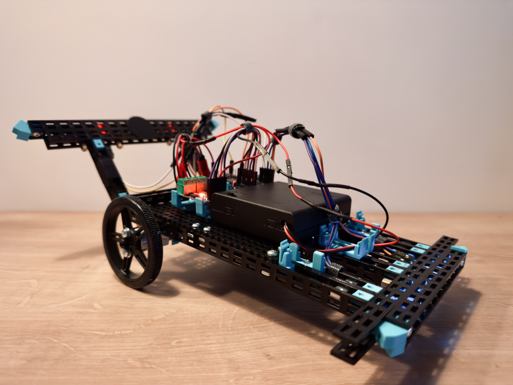
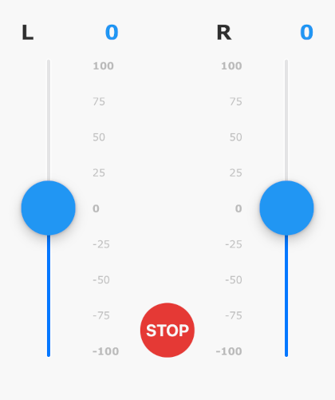

# F0.1

F0.1 -- the slowest robot in the world.

## Operation

1. Obtain a client device, such as a smartphone, tablet, or laptop.
2. Turn on F0.1.  
  The internal LED blinks, indicating that F0.1 is waiting for a connection from a client.
3. With a client device, connect to the `F0.1` network over WiFi.  
  The password is `F0.1-okoń`. Once the client device connects, the internal LED stays on.
4. On the client device, in a web browser, open [http://192.168.4.1]([https://](http://192.168.4.1))
5. Control F0.1 using the web interface.  
  
6. (optional) Connect an Xbox controller to the client device and control F0.1 with analog sticks.  
  To make the controller work on iOS, interact with the sliders using the web interface first.

## Development

Create your own F0.1!

### Components

| Component         | Quantity | Description                                 |
|-------------------|----------|---------------------------------------------|
| Controller        | 1        | Raspberry Pi Pico W                         |
| Motors            | 2        | Mini Micro N20 Gear Motor DC 3V-6V          |
| Motors driver     | 1        | L9110S Motor Driver Module                  |
| White LED         | 2        | 5mm white LED                               |
| Red LED           | 2        | 5mm red LED                                 |
| Orange LED        | 4        | 5mm orange LED                              |
| LED resistor      | 8        | 220Ω (ohm) resistor for each LED            |
| Wires             | Several  | Jumper wires for connections                |
| Frame             | 1        | Chassis/frame ~20cm X 10cm                  |
| Back wheels       | 2        | 60mm                                        |
| Ball caster       | 1        | 1/2" metal for front                        |
| Battery cage      | 1        | 4X AA R6 NiMH 1.2V rechargeable batteries   |
| Client device     | 1        | Device to access RPi AP over Wi-Fi          |
| Xbox controller   | 1        | Optional controller connected to client     |

### Software

1. Flash the latest MicroPython onto the Raspberry Pi Pico W(H).
2. Upload the necessary files from this repository to Raspberry Pi Pico W(H).

**NOTE:** F0.1 does not require you to install any libraries.

### Wiring

#### Raspberry Pi Pico W wiring

| Pico W GPIO Pin | Connects to               | Description                      |
|-----------------|---------------------------|----------------------------------|
| GPIO17          | Motor 1 IN1 (A1-A)        | L9110S Motor Driver              |
| GPIO18          | Motor 1 IN2 (A1-B)        | L9110S Motor Driver              |
| GPIO19          | Motor 2 IN3 (B1-A)        | L9110S Motor Driver              |
| GPIO20          | Motor 2 IN4 (B1-B)        | L9110S Motor Driver              |
| GPIO13          | Red LED 1                 | With a 220Ω resistor             |
| GPIO12          | Red LED 2                 | With a 220Ω resistor             |
| GPIO15          | White LED 1               | With a 220Ω resistor             |
| GPIO14          | White LED 2               | With a 220Ω resistor             |
| GND             | Common Ground             | Connect to ground pins           |
| VSYS (5V IN)    | Power Input               | From the battery pack            |

#### L9110S motor driver wiring

| L9110S Pin      | Connects to          | Description           |
|-----------------|----------------------|-----------------------|
| A-1A (IN1)      | Pico GPIO17          | Motor 1 Input 1       |
| A-1B (IN2)      | Pico GPIO18          | Motor 1 Input 2       |
| B-1A (IN3)      | Pico GPIO19          | Motor 2 Input 1       |
| B-1B (IN4)      | Pico GPIO20          | Motor 2 Input 2       |
| VCC             | Battery pack (+)     | Power for motors      |
| GND             | Common ground        | Common ground         |
| OA (Motor 1 +)  | Motor 1 terminal     | Connect to motor lead |
| OB (Motor 1 -)  | Motor 1 terminal     | Connect to motor lead |
| OA (Motor 2 +)  | Motor 2 terminal     | Connect to motor lead |
| OB (Motor 2 -)  | Motor 2 terminal     | Connect to motor lead |
